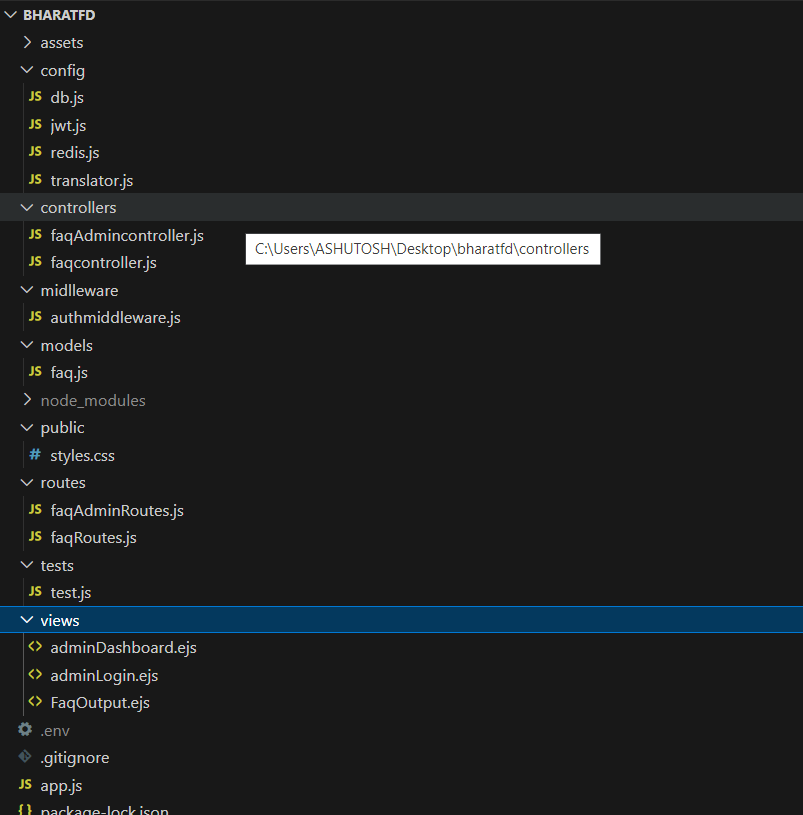

# Multilingual FAQ API

## Overview

Multilingual FAQ API is a RESTful API designed to manage FAQs in multiple languages. It integrates with Google Cloud Translate to provide language translation and uses Redis for caching. This API also secures routes using JWT for authentication.

## Features

- **Multilingual Support**: Translates FAQs to various languages.
- **Caching**: Leverages Redis for efficient caching.
- **Authentication**: Implements JWT for secure access to protected routes.
- **CRUD Operations**: Full support for creating, reading, updating, and deleting FAQs.

## Prerequisites

- Node.js (v14+)
- Express.js(Routing & API)
- JWT(Authentication & Authorization)
- MongoDB (for data storage)
- Redis (for caching)
- dotenv

## Installation (VS Code Environment)

1. Clone the repository:
   ```bash
   git clone https://github.com/your-username/multilingual-faq-api.git
2. Code multilingual-faq-api
    ```bash
   code multilingual-faq-api
3. Install dependencies: Open the integrated terminal in VS Code and run:
  ```bash
   npm install
4. Set up environment variables: Create a .env file at the root of the project:
  ```bash
   PORT=3000
MONGODB_URI=mongodb://localhost:27017/your-db-name
JWT_SECRET=your-secret-key
REDIS_PORT=15499
REDIS_PASS=your-redis-password
REDIS_HOST=your-redis-host


## Project Structure




